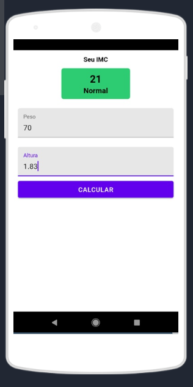

<h1>Calculadora-IMC</h1>

Este projeto teve como objetivo criar um aplicativod utilizando o Expo, que é uma ferramenta para desenvolvimento em React Native.

## Tecnologias utilizadas:

  - [Expo](https://expo.io/)
  - [React Native](https://reactnative.dev/)
  - [react native paper](https://callstack.github.io/react-native-paper/)

## Screenshots

